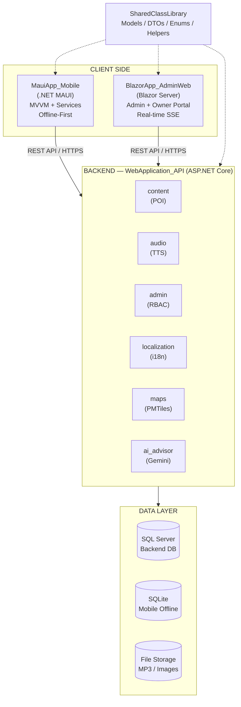
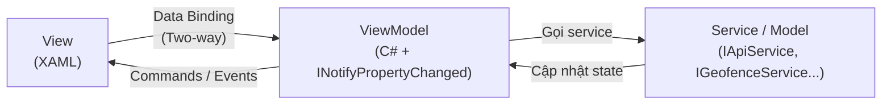
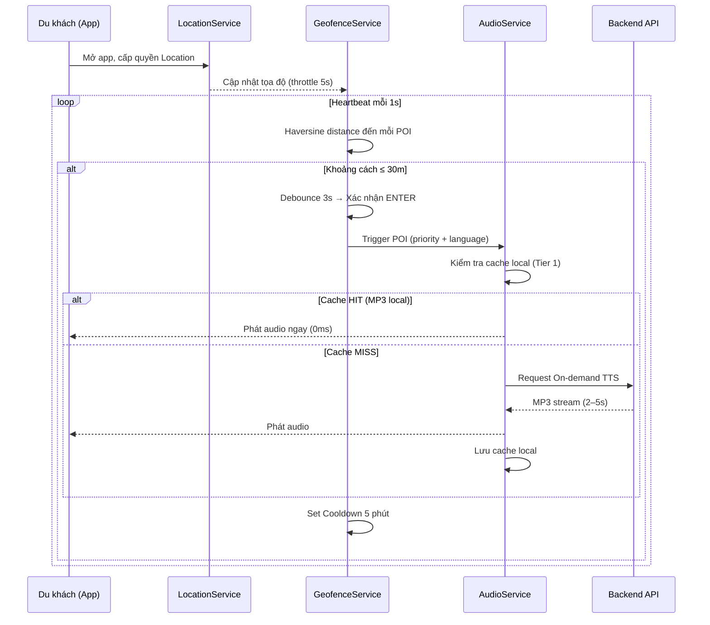
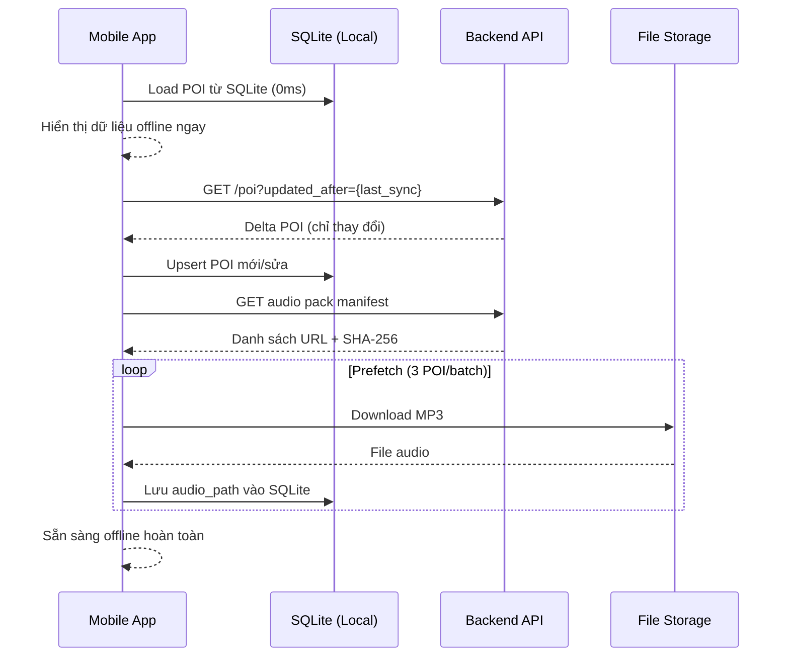
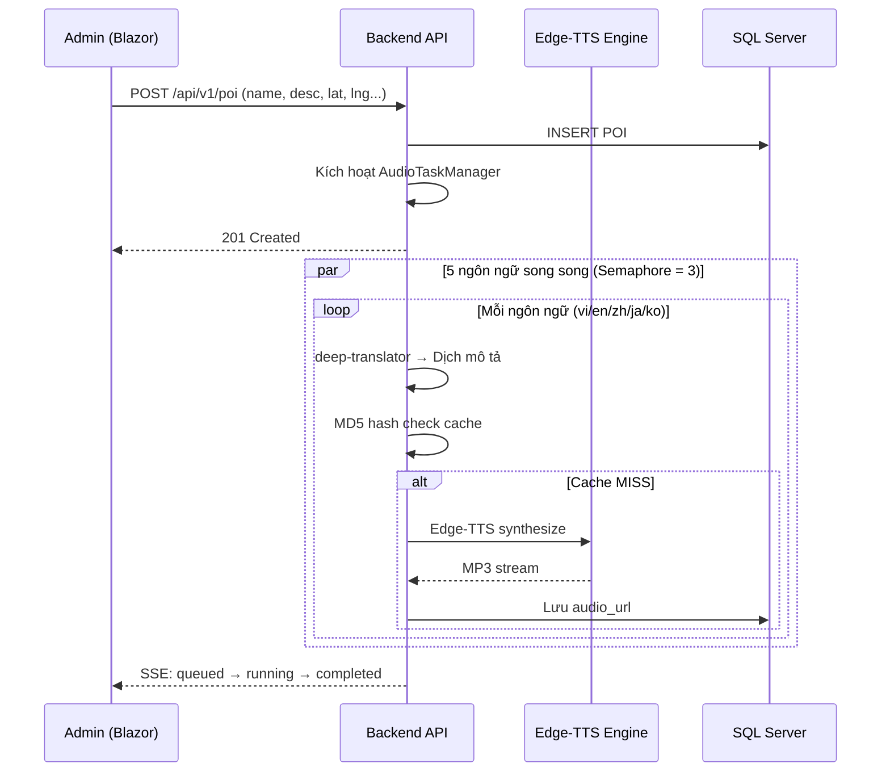
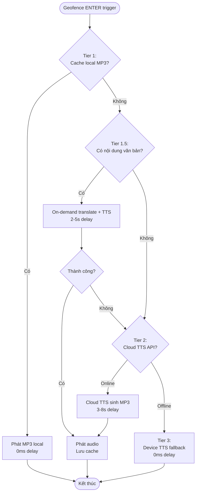
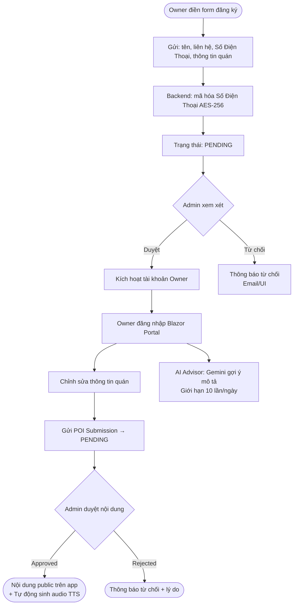
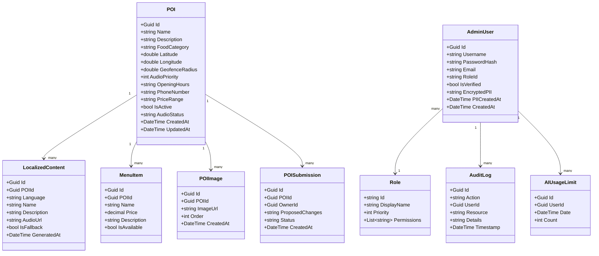
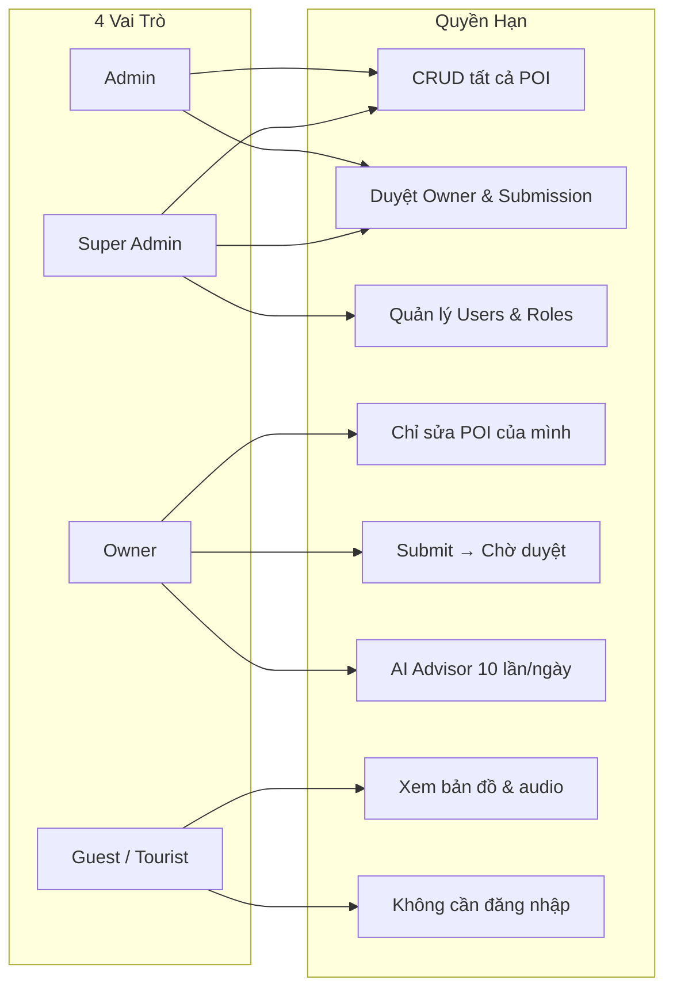

# 📱 PRD — App Thuyết Minh Phố Ẩm Thực Vĩnh Khánh

<h1> Audio Guide App for Vinh Khanh Food Street </h1>

---

## 📋 Thông Tin Dự Án

| Trường | Nội dung |
|---|---|
| **Tên dự án** | App Thuyết Minh Phố Ẩm Thực Vĩnh Khánh |
| **Phiên bản tài liệu** | v1.0 (Final Merged) |
| **Ngày cập nhật** | 2026 |
| **Trạng thái** | 🟡 In Development |
| **Phiên bản mục tiêu** | MVP — Android (Q3/2026) |
| **Nền tảng** | Android (chính) · iOS (phụ) · Web Admin |

### 👥 Thành Viên

| # | Họ và tên | MSSV | Vai trò |
|---|---|---|---|
| 1 | Nguyễn Sĩ Huy | 3123411122 | Product Owner · Mobile Dev · Backend Dev |
| 2 | Nguyễn Văn Cường | 3123411045 | Admin Web Dev |

### 🔗 Bên Liên Quan (Stakeholders)

| Bên | Vai trò |
|---|---|
| Nhóm sinh viên | Phát triển và vận hành hệ thống |
| Giảng viên hướng dẫn | Phê duyệt yêu cầu, kiểm tra tiến độ |
| Chủ các quán ăn trên phố Vĩnh Khánh | Người dùng cuối (Owner) |
| Du khách trong nước và quốc tế | Người dùng cuối (Tourist) |

---

## 1. Mục Tiêu Nhóm & Mục Tiêu Kinh Doanh

### 1.1 Mục Tiêu Nhóm

- Xây dựng thành công hệ thống thuyết minh âm thanh đa ngôn ngữ đầy đủ 3 thành phần (Mobile · Admin Web · Backend API) trong phạm vi học kỳ.
- Áp dụng kiến trúc phần mềm hiện đại: MVVM, RBAC, Offline-First, Modular Monolith.
- Vận hành hệ thống với **chi phí $0** bằng cách dùng Edge-TTS và PMTiles.
- Kiểm thử thực địa trực tiếp tại phố Vĩnh Khánh (Quận 4, TP.HCM).

### 1.2 Mục Tiêu Kinh Doanh

| Mục tiêu | Chỉ số đo lường |
|---|---|
| Nâng cao trải nghiệm du khách tại phố Vĩnh Khánh | ≥ 30 POI có audio đầy đủ 5 ngôn ngữ |
| Giảm rào cản ngôn ngữ cho khách quốc tế | Hỗ trợ vi · en · zh · ja · ko |
| Trao quyền tự quản lý nội dung cho chủ quán | Owner tự cập nhật không cần qua trung gian |
| Hoạt động độc lập với hạ tầng mạng | 100% tính năng cốt lõi offline sau lần sync đầu |
| Mô hình có thể nhân rộng sang phố ẩm thực khác | Kiến trúc module hóa, dễ mở rộng |

---

## 2. Bối Cảnh & Định Hướng Chiến Lược

### 2.1 Bối Cảnh

**Phố Vĩnh Khánh** (Quận 4, TP.HCM) là một trong những tuyến phố ẩm thực đường phố nổi tiếng nhất Sài Gòn, thu hút hàng nghìn lượt khách tham quan mỗi ngày — bao gồm đông đảo du khách quốc tế từ Nhật, Hàn, Trung Quốc, và các nước phương Tây.

**Vấn đề cốt lõi:**

| Vấn đề | Tác động |
|---|---|
| Không biết đặc trưng từng quán | Du khách bỏ qua nhiều điểm thú vị |
| Rào cản ngôn ngữ với khách quốc tế | Khó đặt món, không hiểu nét đặc trưng |
| Mạng không ổn định trong hẻm nhỏ | App thông thường không dùng được |
| Không biết đang đứng gần quán nào | Phải tìm kiếm thủ công, mất thời gian |
| Chủ quán khó cập nhật thông tin | Thông tin lỗi thời, sai lệch |

### 2.2 Định Hướng Chiến Lược

Dự án này là **bước thử nghiệm đầu tiên** cho mô hình "Audio Guide as a Service" cho các tuyến phố du lịch ẩm thực tại Việt Nam. Nếu thành công tại Vĩnh Khánh, mô hình có thể nhân rộng sang phố đi bộ Nguyễn Huệ, Bùi Viện, Hồ Tây (Hà Nội).

**Định hướng kỹ thuật:**
- **Offline-First**: Ưu tiên hoạt động không cần mạng — phù hợp với hẻm nhỏ, khu vực mạng yếu.
- **Zero Cost**: Dùng Edge-TTS (Microsoft, miễn phí) và PMTiles (bản đồ offline không phí) để vận hành $0.
- **Multi-language Native**: Mỗi ngôn ngữ có giọng đọc tự nhiên riêng, không dùng giọng robot.

---

## 3. Giả Định (Assumptions)

### 3.1 Giả Định Kỹ Thuật

| # | Giả định | Rủi ro nếu sai |
|---|---|---|
| T1 | Edge-TTS (Microsoft) tiếp tục hoạt động miễn phí trong suốt vòng đời MVP | Cần chuyển sang provider TTS khác (Google TTS, ElevenLabs) — phát sinh chi phí |
| T2 | Thiết bị Android của người dùng chạy API 26+ (Android 8.0+) | Một số tính năng foreground service không khả dụng trên API cũ hơn |
| T3 | GPS trên thiết bị Android cho phép độ chính xác ≤ 30m tại khu vực hẻm | Ngưỡng geofence phải mở rộng lên 50m — có thể trigger nhầm |
| T4 | PMTiles phủ đủ chi tiết khu vực Quận 4 ở zoom level 15–18 | Phải mua bản đồ hoặc dùng OpenStreetMap với chất lượng thấp hơn |
| T5 | SQLite trên MAUI hỗ trợ đầy đủ các tính năng cần thiết (upsert, index) | Phải viết raw SQL thay vì dùng ORM trừu tượng |
| T6 | Google Gemini 2.0 Flash API ổn định trong giai đoạn phát triển | AI Advisor feature bị ảnh hưởng, có thể tắt feature này |

### 3.2 Giả Định Kinh Doanh

| # | Giả định |
|---|---|
| B1 | Chủ quán trên phố Vĩnh Khánh sẵn sàng cung cấp thông tin quán (giờ mở cửa, menu, ảnh) |
| B2 | Du khách quốc tế mang theo điện thoại và sẵn sàng cài app trước khi đến |
| B3 | Dữ liệu POI ban đầu (30+ quán) được nhóm thu thập trực tiếp qua khảo sát thực địa |
| B4 | Admin (nhóm sinh viên) có thể duyệt nội dung Owner trong vòng 24–48 giờ |

### 3.3 Giả Định Người Dùng

| # | Giả định |
|---|---|
| U1 | Du khách quốc tế biết chọn ngôn ngữ trong phần Settings |
| U2 | Du khách cho phép app truy cập vị trí GPS khi được hỏi |
| U3 | Chủ quán có smartphone Android hoặc iOS và biết sử dụng trình duyệt web |

---

## 4. Đối Tượng Người Dùng & User Stories

### 4.1 Personas

#### 👤 Du khách nội địa / Domestic Tourist
- **Mô tả:** Người dùng điện thoại Android/iOS, muốn khám phá đặc sản Quận 4, không rành địa bàn.
- **Thiết bị:** Android phổ thông (Samsung A-series, Xiaomi Redmi...)
- **Kỹ năng công nghệ:** Trung bình — dùng Google Maps thành thạo
- **Nhu cầu:** Xem bản đồ, nghe giới thiệu món ăn, biết giờ mở cửa.

#### 🌏 Du khách quốc tế / International Tourist
- **Mô tả:** Người nước ngoài (Nhật/Hàn/Trung) không đọc được tiếng Việt, đến đây theo gợi ý.
- **Thiết bị:** iPhone hoặc Android cao cấp
- **Kỹ năng công nghệ:** Cao — thường dùng audio guide tại bảo tàng
- **Nhu cầu:** Nghe audio bằng ngôn ngữ mẹ đẻ, xem ảnh, hiểu đặc trưng từng quán.

#### 🏪 Chủ quán / Shop Owner (POI Owner)
- **Mô tả:** Chủ các hàng ăn trên phố Vĩnh Khánh, có thể không rành công nghệ.
- **Thiết bị:** Truy cập qua trình duyệt web (máy tính hoặc điện thoại)
- **Nhu cầu:** Cập nhật thông tin quán, menu, ảnh; nhận được nhiều khách hơn.

#### 🛡️ Quản trị viên / Administrator
- **Mô tả:** Nhóm sinh viên vận hành hệ thống, kiểm duyệt nội dung.
- **Nhu cầu:** CRUD toàn bộ POI, quản lý tài khoản, theo dõi hệ thống, kiểm soát nội dung.

### 4.2 User Stories & Success Criteria

#### Du khách

| ID | User Story | Điều kiện thành công |
|----|---|---|
| US-T01 | Là du khách, tôi muốn **tự động nghe giới thiệu** khi đến gần một quán ăn mà không cần nhấn nút. | Audio bắt đầu phát ≤ 3 giây sau khi vào vùng geofence 30m |
| US-T02 | Là du khách quốc tế, tôi muốn **chọn ngôn ngữ** và nghe bằng tiếng mẹ đẻ. | 5 ngôn ngữ hiển thị trong Settings; audio phát đúng ngôn ngữ |
| US-T03 | Là du khách, tôi muốn **xem bản đồ** biết mình đang đứng ở đâu và quán nào xung quanh. | Bản đồ hiển thị ≤ 2 giây; marker POI hiện đủ 30+ điểm |
| US-T04 | Là du khách, tôi muốn **dùng app khi không có mạng** trong hẻm nhỏ. | Bản đồ, danh sách POI, audio Tier 1 hoạt động 100% offline |
| US-T05 | Là du khách, tôi muốn **xem chi tiết POI**: ảnh, giờ mở cửa, menu, mô tả. | Detail screen load đủ thông tin ≤ 1 giây từ cache |
| US-T06 | Là du khách, tôi muốn **nghe lại audio** bất kỳ lúc nào từ màn hình chi tiết. | Nút Play/Pause hoạt động trên POI Detail Page |

#### Chủ quán

| ID | User Story | Điều kiện thành công |
|-----|---|---|
| US-O01 | Là chủ quán, tôi muốn **đăng ký tài khoản** và được admin xét duyệt. | Form đăng ký gửi thành công; nhận thông báo khi được duyệt |
| US-O02 | Là chủ quán, tôi muốn **cập nhật thông tin quán** của mình mà không ảnh hưởng quán khác. | Chỉ thấy POI của mình trong portal; submission đi qua bước duyệt |
| US-O03 | Là chủ quán, tôi muốn **dùng AI** để cải thiện mô tả quán (giới hạn 10 lần/ngày). | Gemini trả về gợi ý mô tả mới trong ≤ 30 giây |

#### Admin

| ID | User Story | Điều kiện thành công |
|---|---|---|
| US-A01 | Là admin, tôi muốn **tạo/sửa/xóa POI** và tự động kích hoạt sinh audio. | Background task tự chạy sau POST /poi thành công |
| US-A02 | Là admin, tôi muốn **duyệt đăng ký** của chủ quán trước khi họ được phép chỉnh sửa. | Workflow: Pending → Approved/Rejected với thông báo |
| US-A03 | Là admin, tôi muốn **theo dõi tiến trình** sinh audio theo thời gian thực. | SSE stream hiển thị progress bar từng ngôn ngữ |
| US-A04 | Là admin, tôi muốn **xem audit log** để biết ai đã làm gì trong hệ thống. | Bảng log có filter theo user, action, thời gian |

---

## 5. Phạm Vi Tính Năng (Feature Scope)

### 5.1 Trong Phạm Vi — MVP

| Tính năng | Platform | Độ ưu tiên |
|---|---|---|
| Bản đồ tương tác hiển thị POI (online + offline) | Mobile | P0 |
| GPS + Geofencing tự động kích hoạt audio | Mobile | P0 |
| Phát audio thuyết minh đa ngôn ngữ (5 tiếng) | Mobile | P0 |
| Tải dữ liệu offline (SQLite + audio cache) | Mobile | P0 |
| Màn hình chi tiết POI (ảnh, mô tả, giờ mở cửa, menu) | Mobile | P0 |
| Chọn ngôn ngữ thuyết minh | Mobile | P1 |
| Cài đặt tải gói offline | Mobile | P1 |
| Đăng nhập Admin / Owner | Web | P0 |
| CRUD POI, Menu, Hình ảnh | Web | P0 |
| Quản lý tài khoản + phân quyền RBAC | Web | P0 |
| Owner Portal (đăng ký, duyệt, quản lý quán) | Web | P1 |
| AI Advisor cải thiện mô tả | Web | P2 |
| Theo dõi tiến trình TTS realtime (SSE) | Web | P1 |
| Sinh audio TTS tự động khi tạo POI | Backend | P0 |
| API RESTful đầy đủ + đồng bộ offline (delta sync) | Backend | P0 |
| Phân quyền RBAC động | Backend | P1 |

### 5.2 Ngoài Phạm Vi — Sẽ Cân Nhắc Sau (Out of Scope)

| Tính năng | Lý do loại |
|---|---|
| Hệ thống thanh toán / booking tour | Phức tạp, không thuộc core use case |
| Live chat giữa du khách và chủ quán | Cần real-time infra phức tạp |
| Push notification | Cần server-side scheduling, không phải Offline-First |
| Tích hợp mạng xã hội (đăng review, share) | Out of scope với MVP |
| Server-side geofencing | Client-side đủ cho MVP, server-side cần compute lớn hơn |
| Routing / chỉ đường trong phố | MapLibre cần thêm routing engine (OSRM) |
| Tính năng đặt bàn / xếp hàng | Cần tích hợp 3rd party |
| Dashboard phân tích (analytics) | Phase 2 — cần thu thập dữ liệu trước |

---

## 6. Yêu Cầu Chức Năng (Functional Requirements)

### 6.1 Module Mobile — Ứng Dụng .NET MAUI

#### FR-M01: Khởi Động Ứng Dụng

Khi mở app, hệ thống phải thực hiện tuần tự:
1. Hiển thị Splash Screen.
2. Đăng ký foreground service GPS (Android).
3. Nhắc chọn ngôn ngữ (lần đầu tiên).
4. **Song song:** lấy tọa độ GPS (timeout 10s) + tải POI từ SQLite (0ms) + gọi API sync delta.
5. Cập nhật UI dần (offline data hiện trước, online cập nhật sau).

#### FR-M02: Bản Đồ Tương Tác

- Hiển thị bản đồ khu vực phố Vĩnh Khánh với marker POI.
- Đánh dấu vị trí người dùng (chấm xanh), cập nhật mỗi 5 giây.
- Nhấn marker → mở POI Detail Page.
- Hỗ trợ zoom, pan, rotate.
- **Offline:** Render từ PMTiles cache (Quận 4 bbox: 106.69–106.715, 10.745–10.765).
- **Online:** Render từ MapTiler API.

#### FR-M03: GPS + Geofencing — 4 Giai Đoạn

| Giai đoạn | Mô tả |
|---|---|
| **G1 — GPS Collection** | `ILocationService` liên tục, throttle 5s. Cập nhật marker vị trí trên map. |
| **G2 — Zone Detection** | Haversine distance tới từng POI. ≤ `geofence_radius` (default 30m) → thêm vào `pendingEntries`. Cooldown 5 phút sau mỗi trigger. |
| **G3 — Audio Decision (Heartbeat 1s)** | `ReconcileLoop` mỗi 1s: xác nhận ENTER sau debounce 3s → chọn POI ưu tiên (priority → khoảng cách) → gửi tới AudioService. |
| **G4 — Audio Playback** | `IAudioService.PlayWithFallback(poi, lang)` → 4-Tier Hybrid (xem FR-M04). |

#### FR-M04: Audio Thuyết Minh — 4-Tier Hybrid

| Tier | Tên | Độ trễ | Điều kiện |
|---|---|---|---|
| **Tier 1** | Pre-generated (Cache Local) | 0ms | File MP3 đã cache trong SQLite/local storage |
| **Tier 1.5** | On-demand Translate + TTS | 2–5s | Có nội dung nhưng chưa có audio ngôn ngữ này |
| **Tier 2** | Cloud TTS API | 3–8s | Cần sinh mới từ server, lưu cache sau |
| **Tier 3** | Device TTS (Fallback) | 0ms | Offline hoàn toàn, không có file nào |

Queue: Chỉ phát 1 audio tại một thời điểm. Audio mới có priority cao hơn sẽ ngắt audio đang phát.

#### FR-M05: Màn Hình Chi Tiết POI

- Carousel ảnh (tối đa 8 ảnh, swipe).
- Tên, loại ẩm thực, đặc trưng nổi bật (theo ngôn ngữ đã chọn).
- Mô tả chi tiết, giờ mở cửa, số điện thoại, giá tầm.
- Nút Play/Pause audio thuyết minh.
- Danh sách menu (tên món + giá).
- Khoảng cách từ vị trí hiện tại.

#### FR-M06: Offline & Đồng Bộ Dữ Liệu

**Logic tải audio theo dung lượng thiết bị:**

```
Tổng kích thước audio pack (ngôn ngữ đã chọn)
        ↓
┌─────────────────────────────────────┐
│  audio_pack_size ≤ free_storage?    │
└─────────────────────────────────────┘
        │ YES                 │ NO
        ▼                     ▼
  Tải toàn bộ audio      Stream từ server
  → 100% offline          theo từng POI
  → Không cần mạng nữa   → Cache dần (LRU)
```

| Trạng thái | Điều kiện | Hành vi |
|---|---|---|
| **Full offline** | `audio_pack_size ≤ free_space` | Tải hết, không cần mạng |
| **Streaming** | `audio_pack_size > free_space` | Stream + cache dần từng POI |
| **Hybrid** | Offline 80% + stream 20% | Hotset tải trước, còn lại stream |

- **SQLite:** Lưu toàn bộ POI, nội dung đa ngôn ngữ, metadata, audio_path.
- **Delta Sync:** So sánh `updated_at` → chỉ tải POI thay đổi.
- **Hotset:** Khi mở app, pre-translate 10 POI gần nhất trong 1.5km (timeout GPS 2.5s).
- **LRU Cache Eviction:** Khi đầy bộ nhớ → xóa audio cũ ít dùng.

#### FR-M07: Màn Hình Cài Đặt

- Chọn / thay đổi ngôn ngữ thuyết minh.
- Tải gói dữ liệu offline (POI + Audio + Bản đồ).
- Xem trạng thái dung lượng đã dùng (với cảnh báo khi < 100MB).
- Bật/tắt tự động phát audio khi vào zone.

---

### 6.2 Module Admin Web — Blazor Server

#### FR-A01: Xác Thực

- Đăng nhập username + password. JWT httpOnly cookie (30 phút Access / 7 ngày Refresh).
- Tự động refresh token. Dual-mode: Cookie (browser) + Bearer Header (API).

#### FR-A02: Quản Lý POI

- **Danh sách:** Filter (tên, loại, trạng thái) + phân trang.
- **Tạo mới:** Form nhập name, description (VI), tọa độ (map picker), ảnh, giờ mở cửa, geofence_radius, audio_priority.
- **Sửa:** Chỉnh sửa mọi trường, upload/xóa ảnh (tối đa 8 ảnh, ≤ 5MB/ảnh).
- **Xóa:** Cascade xóa localizations + file ảnh/audio.
- **Toggle:** Bật/tắt hiển thị POI trên app.
- Sau tạo/sửa → **tự động kích hoạt background task** sinh audio 5 ngôn ngữ.

#### FR-A03: Quản Lý Audio — Thời Gian Thực

- Xem tiến trình sinh audio theo POI và ngôn ngữ.
- **Real-time progress** qua SSE: queued → running → completed/failed.
- Hành động: Pause / Resume / Cancel từng task.
- Tối đa 3 task TTS song song (Semaphore = 3).

#### FR-A04: Quản Lý Người Dùng & Phân Quyền

- CRUD tài khoản Admin và Owner.
- CRUD Roles với permissions tùy chỉnh.
- Duyệt đăng ký Owner: Pending → Approved/Rejected.
- Xem Audit Log (action, user, resource, timestamp).

#### FR-A05: Owner Portal

- **Đăng ký:** Form tên, liên hệ, Số Điện Thoại, thông tin quán → status `pending`.
- **Sau duyệt:** Đăng nhập, chỉnh sửa chỉ quán của mình.
- **Submit:** Gửi POI Submission → Admin duyệt → public.
- **AI Advisor:** Gemini gợi ý mô tả mới (giới hạn 10 lần/ngày).
- **PII:** Số Điện Thoại mã hóa AES-256, tự xóa sau 180 ngày.

---

### 6.3 Module Backend — ASP.NET Core API

#### FR-B01: Module Content (POI)

| Endpoint | Method | Auth | Mô tả |
|---|---|---|---|
| `/api/v1/poi` | GET | Không | Danh sách tất cả POI |
| `/api/v1/poi/load-all` | GET | Không | POI + localization theo `?lang=` |
| `/api/v1/poi/nearby` | GET | Không | POI trong bán kính `?lat=&lng=&radius=` |
| `/api/v1/poi/{id}` | GET | Không | Chi tiết 1 POI |
| `/api/v1/poi` | POST | Admin | Tạo POI mới |
| `/api/v1/poi/{id}` | PUT | Admin | Cập nhật POI |
| `/api/v1/poi/{id}` | DELETE | Admin | Xóa cascade |
| `/api/v1/poi/{id}/images` | POST | Admin | Upload ảnh |

**3-Tier Content Fallback:**
1. Ngôn ngữ được yêu cầu (target lang)
2. English (fallback, `is_fallback=true`)
3. Tiếng Việt gốc (cuối cùng, `audio_url = null`)

#### FR-B02: Module Audio / TTS

| Endpoint | Method | Mô tả |
|---|---|---|
| `/api/v1/audio/tts` | POST | Sinh audio MP3 từ text |
| `/api/v1/audio/pack-manifest` | GET | Manifest audio pack (SHA-256, URLs) |
| `/api/v1/audio/tasks/stream` | GET (SSE) | Real-time tiến trình |
| `/api/v1/audio/tasks/{id}/pause` | POST | Tạm dừng task |
| `/api/v1/audio/tasks/{id}/resume` | POST | Tiếp tục task |
| `/api/v1/audio/tasks/{id}/cancel` | POST | Huỷ task |

**TTS Pipeline:**
```
Text gốc (VN)
    → deep-translator → Bản dịch
    → MD5 hash check
        → [HIT]  → Trả file có sẵn
        → [MISS] → Edge-TTS synthesis → Lưu MP3 → Upsert DB → Trả file
```

#### FR-B03: Module Localization

| Endpoint | Method | Mô tả |
|---|---|---|
| `/api/v1/localizations/prepare-hotset` | POST | Dịch + TTS trước cho top N POI gần nhất |
| `/api/v1/localizations/on-demand` | POST | Dịch tức thì 1 POI (rate limit 30/10 phút) |
| `/api/v1/localizations/warmup` | POST | Dịch toàn bộ corpus (background) |

#### FR-B04: Module Maps

| Endpoint | Method | Mô tả |
|---|---|---|
| `/api/v1/maps/offline-manifest` | GET | Manifest: bbox, checksums SHA-256 |
| `/api/v1/maps/packs/{version}/{file}` | GET | Serve PMTiles (Range Requests) |
| `/api/v1/maps/styles/{path}` | GET | Style JSON + sprites |
| `/api/v1/maps/fonts/{fontstack}/{range}.pbf` | GET | Glyph PBFs |

Bảo mật: `resolve_safe_path()` chặn Path Traversal attack.

#### FR-B05: Module Admin & Auth

- Auth: Login, Logout, Refresh Token, Change Password, Me.
- Users: CRUD Admin/Owner.
- Roles: CRUD roles động.
- Owner Registrations: Xem, duyệt/từ chối.
- POI Submissions: Xem, phê duyệt/từ chối.
- Audit Logs: Xem nhật ký (action, user_id, resource, timestamp).

#### FR-B06: Module AI Advisor

| Endpoint | Method | Mô tả |
|---|---|---|
| `/api/v1/ai/enhance-description` | POST | Gemini 2.0 Flash cải thiện mô tả POI |

Ràng buộc: Rate limit Owner 10 lần/ngày · Admin không giới hạn · Timeout 30s · Prompt: KHÔNG bịa thông tin, chỉ thêm tính từ tích cực, 200–300 từ.

---

## 7. Yêu Cầu Phi Chức Năng (Non-Functional Requirements)

### 7.1 Hiệu Năng

| Yêu cầu | Mục tiêu |
|---|---|
| Thời gian phát audio sau trigger geofence | ≤ 3 giây (Tier 1, từ cache) |
| Thời gian load màn hình chính | ≤ 2 giây |
| Thời gian load danh sách POI offline | ≤ 500ms |
| API response time (p95) | ≤ 500ms |
| Cập nhật marker GPS trên map | Mỗi 5 giây |
| Số POI đồng thời trên map | ≤ 500 (performance OK) |

### 7.2 Bảo Mật

- **XSS:** JWT trong httpOnly cookie (JS không đọc được).
- **CSRF:** SameSite=Lax cookie.
- **PII Encryption:** Số Điện Thoại mã hóa AES-256 (Fernet), tự redact sau 180 ngày.
- **Path Traversal Guard:** Tất cả đường dẫn file phải resolve trong base directory.
- **Input Validation:** Kiểm tra toàn bộ input (type, size, format).
- **Rate Limiting:** On-demand TTS (30/10 phút) và AI Advisor (10/ngày cho Owner).
- **RBAC:** Mọi endpoint Admin phải check permission trước.

### 7.3 Offline Availability

- 100% tính năng cốt lõi hoạt động khi offline: map, POI list, geofence, audio Tier 1.
- Background sync khi có mạng — không chặn UI.
- Disk Quota: Khi đầy → LRU eviction audio cache cũ.

### 7.4 Khả Năng Mở Rộng

- MVVM tách biệt View / ViewModel / Service.
- Dependency Injection toàn bộ (`MauiProgram.cs`).
- Interface-driven: mọi Service có Interface (`IApiService`, `IGeofenceService`...) — dễ mock, unit test.
- Modular Monolith backend: 6+ module độc lập, dễ tách microservice.

### 7.5 Usability

- UI mobile: rõ ràng, dùng 1 tay.
- Guest mode: không cần đăng ký để xem bản đồ và nghe audio.
- Đa nền tảng: Android (chính), iOS (phụ).
- Font tối thiểu 14sp, nút tối thiểu 44dp (WCAG).

---

## 8. Kiến Trúc Hệ Thống

### 8.1 Sơ Đồ Tổng Quan (System Architecture)



### 8.2 Mô Hình MVVM (MAUI Mobile)



### 8.3 Luồng Khởi Động Backend

```
[1] Security Config Check
    → Kiểm tra JWT_SECRET, PII_ENCRYPTION_KEY khác default
    → Từ chối khởi động nếu không an toàn

[2] Database Connection
    → Kết nối SQL Server qua Entity Framework Core

[3] Data Seeding
    → ensure_roles() → 4 default roles + Super Admin
    → Seed POI mẫu nếu DB trống

[4] Indexing
    → Compound index {poi_id, lang} trên LocalizedContent
    → Spatial index trên POI.Location

[5] Mount Routers → Server Ready
    → content, audio, admin, owner, ai, localization, maps (/api/v1)
```

---

## 9. Sơ Đồ Luồng Nghiệp Vụ

### 9.1 Sequence Diagram — Geofencing → Audio



### 9.2 Sequence Diagram — Offline Sync



### 9.3 Sequence Diagram — Admin Tạo POI & Sinh Audio



### 9.4 Activity Diagram — Audio Decision (4-Tier)



### 9.5 Activity Diagram — Owner Registration



---

## 10. Mô Hình Dữ Liệu (Data Models)

### 10.1 UML Class Diagram



### 10.2 Backend Database (SQL Server)

```csharp
// Bảng POIs
public class POI {
    public Guid Id { get; set; }
    public string Name { get; set; }              // Tên quán (VI)
    public string Description { get; set; }       // Mô tả gốc (VI)
    public string FoodCategory { get; set; }
    public double Latitude { get; set; }
    public double Longitude { get; set; }
    public double GeofenceRadius { get; set; }    // mét, default = 30
    public int AudioPriority { get; set; }        // Thấp = ưu tiên cao hơn
    public string OpeningHours { get; set; }
    public string PhoneNumber { get; set; }
    public string PriceRange { get; set; }
    public bool IsActive { get; set; }
    public string AudioStatus { get; set; }       // pending | processing | completed
    public DateTime CreatedAt { get; set; }
    public DateTime UpdatedAt { get; set; }
    // Navigation
    public ICollection<POIImage> Images { get; set; }
    public ICollection<LocalizedContent> Localizations { get; set; }
    public ICollection<MenuItem> MenuItems { get; set; }
}

// Bảng LocalizedContent — Index: (POIId, Language) UNIQUE
public class LocalizedContent {
    public Guid Id { get; set; }
    public Guid POIId { get; set; }
    public string Language { get; set; }          // vi | en | zh | ja | ko
    public string Name { get; set; }
    public string Description { get; set; }
    public string AudioUrl { get; set; }          // Đường dẫn file MP3
    public bool IsFallback { get; set; }
    public DateTime GeneratedAt { get; set; }
}

// Bảng AdminUsers
public class AdminUser {
    public Guid Id { get; set; }
    public string Username { get; set; }
    public string PasswordHash { get; set; }      // bcrypt
    public string RoleId { get; set; }
    public bool IsVerified { get; set; }
    public string EncryptedPII { get; set; }      // AES-256 Số Điện Thoại (Owner only)
    public DateTime PIICreatedAt { get; set; }    // Để redact sau 180 ngày
    public DateTime CreatedAt { get; set; }
    public Role Role { get; set; }
}

// Bảng Roles
public class Role {
    public string Id { get; set; }                // super_admin | admin | poi_owner | user
    public string DisplayName { get; set; }
    public int Priority { get; set; }             // 0 = cao nhất
    public List<string> Permissions { get; set; } // JSON array
}

// Các bảng khác
// POIImages         → Id, POIId, ImageUrl, Order, CreatedAt
// MenuItems         → Id, POIId, Name, Price, Description, IsAvailable
// POIOwnerRegs      → Id, UserId, BusinessName, EncryptedSố Điện Thoại, Status (pending/approved/rejected)
// POISubmissions    → Id, POIId, OwnerId, ProposedChanges (JSON), Status
// AIUsageLimits     → Id, UserId, Date, Count
// AuditLogs         → Id, Action, UserId, Resource, Details (JSON), Timestamp
```

### 10.3 Mobile Database (SQLite)

```csharp
[Table("OfflinePOIs")]
public class OfflinePOI {
    [PrimaryKey] public string Id { get; set; }
    public string Name { get; set; }
    public string Description { get; set; }       // Theo ngôn ngữ đã chọn
    public string Language { get; set; }
    public double Latitude { get; set; }
    public double Longitude { get; set; }
    public double GeofenceRadius { get; set; }
    public int AudioPriority { get; set; }
    public string AudioPath { get; set; }          // Path MP3 local
    public string AudioUrl { get; set; }           // URL server (fallback)
    public bool IsFallback { get; set; }
    public string ImagesJson { get; set; }         // JSON array of URLs
    public string OpeningHours { get; set; }
    public string PhoneNumber { get; set; }
    public string PriceRange { get; set; }
    public string MenuItemsJson { get; set; }      // JSON array
    public DateTime SyncedAt { get; set; }
}

[Table("AppSettings")]
public class AppSetting {
    [PrimaryKey] public string Key { get; set; }
    public string Value { get; set; }
    // Keys: selected_lang, last_sync_time, offline_map_version, offline_audio_version
}
```

---

## 11. Thiết Kế API

### 11.1 Quy Tắc Chung

- Base URL: `https://[host]/api/v1`
- Format: `application/json`
- Auth: `Authorization: Bearer {token}` hoặc httpOnly Cookie
- Pagination: `?page=1&per_page=20` → Response kèm `total`, `pages`

**Error format:**
```json
{
  "error": "NOT_FOUND",
  "message": "POI không tồn tại",
  "detail": null
}
```

### 11.2 Nhóm Endpoint

| Nhóm | Prefix | Auth |
|---|---|---|
| POI (Public) | `/api/v1/poi` | Không cần |
| Audio | `/api/v1/audio` | Một phần |
| Localization | `/api/v1/localizations` | Không cần (public read) |
| Maps | `/api/v1/maps` | Không cần |
| Admin | `/api/v1/admin` | Admin JWT |
| Owner | `/api/v1/owner` | Owner JWT |
| AI Advisor | `/api/v1/ai` | Admin/Owner JWT |

### 11.3 Tóm Tắt Endpoint

| Module | Endpoint | Method | Mô tả |
|---|---|---|---|
| **Content** | `/api/v1/poi` | GET/POST | Danh sách / Tạo POI |
| | `/api/v1/poi/{id}` | GET/PUT/DELETE | Chi tiết / Sửa / Xóa |
| | `/api/v1/poi/nearby` | GET | POI theo bán kính |
| | `/api/v1/poi/{id}/images` | POST | Upload ảnh |
| **Audio** | `/api/v1/audio/tts` | POST | Sinh audio MP3 |
| | `/api/v1/audio/pack-manifest` | GET | Manifest audio pack |
| | `/api/v1/audio/tasks/stream` | GET (SSE) | Real-time tiến trình |
| **Localization** | `/api/v1/localizations/prepare-hotset` | POST | Pre-translate top POI |
| | `/api/v1/localizations/on-demand` | POST | Dịch tức thì 1 POI |
| | `/api/v1/localizations/warmup` | POST | Dịch toàn bộ (background) |
| **Maps** | `/api/v1/maps/offline-manifest` | GET | Manifest PMTiles |
| | `/api/v1/maps/packs/{version}/{file}` | GET | Serve PMTiles |
| **Admin** | `/api/v1/admin/users` | GET/POST/PUT/DELETE | CRUD Users |
| | `/api/v1/admin/audit-logs` | GET | Xem Audit Log |
| | `/api/v1/admin/owner-registrations` | GET/PUT | Duyệt Owner |
| **AI** | `/api/v1/ai/enhance-description` | POST | Gemini cải thiện mô tả |

---

## 12. Phân Quyền RBAC

### 12.1 Domains & Permissions (29 permissions tổng)

| Domain | Permissions |
|---|---|
| `poi` | read, create, update, delete, approve, toggle |
| `menu` | read, create, update, delete |
| `user` | read, create, update, delete |
| `role` | read, create, update, delete |
| `analytics` | view, export, view_own |
| `audit` | read, manage |
| `system` | config, logs, backup |
| `owner` | register, access, submit_poi, manage_own_poi |
| `content` | moderate, publish |

### 12.2 Default Roles

| Role | Priority | Permissions |
|---|---|---|
| `super_admin` | 0 (cao nhất) | Tất cả 29 permissions |
| `admin` | 1 | POI, Menu, User, Role, Analytics, Audit, Content |
| `poi_owner` | 10 | poi:read + owner:* + menu:read/create/update + analytics:view_own |
| `user` | 100 | poi:read + menu:read + owner:register |

### 12.3 Sơ Đồ Phân Quyền



### 12.4 Cơ Chế

- **Static permissions:** Định nghĩa trong code (enum), không thay đổi runtime.
- **Dynamic roles:** Lưu trong DB, Admin tạo role tùy chỉnh.
- **JWT payload:** Chứa danh sách permissions → không query DB mỗi request.
- **Role cache TTL:** 300s — sau khi đổi role, token cũ vẫn valid tối đa 5 phút.
- **Route Guard:** `[RequirePermission("poi:delete")]` annotate trên mỗi endpoint.

---

## 13. Cấu Trúc Đồ Án

```
WebAppThuyetMinh/
│
├── README.md
│
├── MauiApp_Mobile/
│   ├── MauiProgram.cs              # DI registration
│   ├── App.xaml / App.xaml.cs
│   ├── AppShell.xaml               # Navigation shell
│   ├── Models/
│   │   └── ObservablePOI.cs
│   ├── ViewModels/
│   │   ├── BaseViewModel.cs        # INotifyPropertyChanged
│   │   ├── MainViewModel.cs
│   │   ├── MapViewModel.cs
│   │   └── SettingsViewModel.cs
│   ├── Views/
│   │   ├── MainPage.xaml
│   │   ├── MapPage.xaml
│   │   ├── POIDetailPage.xaml
│   │   └── SettingsPage.xaml
│   ├── Services/
│   │   ├── IApiService.cs / ApiService.cs
│   │   ├── IDatabaseService.cs / DatabaseService.cs
│   │   ├── IGeofenceService.cs / GeofenceService.cs
│   │   ├── IAudioService.cs / AudioService.cs
│   │   └── ILocationService.cs / LocationService.cs
│   ├── Helpers/
│   │   ├── AppConstants.cs
│   │   └── PermissionsHelper.cs
│   ├── Platforms/
│   │   ├── Android/
│   │   ├── iOS/
│   │   └── Windows/
│   └── Resources/
│       ├── Raw/                    # File MP3 mặc định
│       ├── Fonts/
│       ├── Images/
│       └── Styles/
│
├── BlazorApp_AdminWeb/
│   ├── Program.cs
│   ├── Components/
│   │   ├── Layout/
│   │   │   ├── MainLayout.razor
│   │   │   └── NavMenu.razor
│   │   └── Pages/
│   │       ├── Home.razor
│   │       ├── POI/               # CRUD POI pages
│   │       ├── Audio/             # Audio task monitor
│   │       ├── Users/             # User & Role management
│   │       ├── Owner/             # Owner portal
│   │       └── AuditLog/
│   └── wwwroot/
│
├── WebApplication_API/
│   ├── Program.cs
│   ├── Modules/
│   │   ├── Content/               # POI endpoints
│   │   ├── Audio/                 # TTS + task manager
│   │   ├── Localization/          # i18n + hotset
│   │   ├── Maps/                  # PMTiles server
│   │   ├── Admin/                 # RBAC + auth + audit
│   │   └── AI/                    # Gemini advisor
│   ├── Infrastructure/
│   │   ├── Data/                  # EF Core DbContext
│   │   ├── Services/              # Background services
│   │   └── Middleware/
│   └── appsettings.json
│
└── Project_SharedClassLibrary/
    ├── Models/                     # POI, User, Role...
    ├── DTOs/
    │   ├── Requests/
    │   └── Responses/
    ├── Enums/
    │   ├── LanguageType.cs
    │   ├── POIPriority.cs
    │   └── AudioSourceType.cs
    ├── Helpers/
    │   └── GeoLocationHelper.cs    # Haversine formula
    └── Constants/
        └── ApiEndpoints.cs
```

---

## 14. Lộ Trình Phát Triển (Development Milestones)

| Phase | Tuần | Mục tiêu | Deliverable |
|---|---|---|---|
| **Phase 1** — Foundation | 1–2 | Nền tảng cơ bản | Solution setup, SharedLib, Auth API, CRUD POI, SQLite mobile |
| **Phase 2** — Core Mobile | 3–4 | Tính năng di động cốt lõi | GPS, Geofencing, Audio Tier 1+3, MapPage, POIDetailPage |
| **Phase 3** — Audio & i18n | 5–6 | TTS và đa ngôn ngữ | Edge-TTS, SSE progress, Localization endpoints, Offline sync |
| **Phase 4** — Admin Web | 7–8 | Trang quản trị | Blazor UI đầy đủ, RBAC, Owner Portal, Audit Log |
| **Phase 5** — Polish & Maps | 9–10 | Bản đồ offline & hoàn thiện | PMTiles Quận 4, kiểm thử thực địa, UI polish, bug fixes |

### Chi Tiết Phase 1 — Foundation (Tuần 1–2)

- [ ] Tạo Solution .NET, cấu hình DI container.
- [ ] Xây dựng `SharedClassLibrary`: Models, DTOs, Enums, Helpers.
- [ ] Backend: Kết nối SQL Server, EF Core migrations, seed data.
- [ ] Backend: Auth module (Login, JWT, Refresh Token).
- [ ] Backend: CRUD POI cơ bản.
- [ ] Mobile: Tích hợp SQLite, `IDatabaseService` cơ bản.

### Chi Tiết Phase 2 — Core Mobile (Tuần 3–4)

- [ ] `ILocationService` — GPS foreground service (Android).
- [ ] `IGeofenceService` — Haversine, debounce 3s, cooldown 5 phút.
- [ ] `IAudioService` — phát MP3 local, Device TTS fallback.
- [ ] `MapViewModel` + `MapPage.xaml` — marker POI + vị trí user.
- [ ] `POIDetailPage.xaml` — carousel ảnh, mô tả, menu.

### Chi Tiết Phase 3 — Audio & i18n (Tuần 5–6)

- [ ] `TTS Service` — Edge-TTS, deep-translator, MD5 cache, 5 ngôn ngữ.
- [ ] `AudioTaskManager` — Semaphore 3, SSE stream.
- [ ] Localization endpoints — Hotset, On-demand, Warmup.
- [ ] Auto-generate audio khi tạo/sửa POI.
- [ ] Mobile: Download audio + offline sync.
- [ ] `SettingsPage.xaml` — chọn ngôn ngữ, download gói offline.

### Chi Tiết Phase 4 — Admin Web (Tuần 7–8)

- [ ] Blazor: Login, session management.
- [ ] Blazor: CRUD POI + map picker + upload ảnh.
- [ ] Blazor: Real-time Audio Monitor (SSE).
- [ ] Blazor: CRUD Users, Roles, duyệt Owner Registrations.
- [ ] Blazor: Owner Portal — đăng ký, quản lý quán, AI Advisor.
- [ ] Blazor: Audit Log viewer.

### Chi Tiết Phase 5 — Polish & Maps (Tuần 9–10)

- [ ] Chuẩn bị PMTiles file cho Quận 4.
- [ ] Backend: Maps module (serve PMTiles, manifest, fonts, sprites).
- [ ] Mobile: Offline map (PMTiles local protocol).
- [ ] Mobile: 3 chế độ bản đồ (Cloud / Offline / Hybrid).
- [ ] Performance test: đo latency geofence → audio.
- [ ] Bug fixes, UI polish, kiểm thử thực địa tại phố Vĩnh Khánh.

---

## 15. Câu Hỏi Cần Giải Quyết (Open Questions)

| # | Câu hỏi | Người phụ trách | Hạn trả lời | Trạng thái |
|---|---|---|---|---|
| Q1 | Dùng MapLibre hay Microsoft.Maui.Controls.Maps cho mobile? MapLibre hỗ trợ PMTiles tốt hơn nhưng phức tạp hơn. | Nguyễn Sĩ Huy | Tuần 1 | 🔴 Chưa giải quyết |
| Q2 | SQLite có hỗ trợ đủ full-text search để tìm kiếm POI theo tên không? Hay cần implement client-side search? | Nguyễn Văn Cường | Tuần 1 | 🔴 Chưa giải quyết |
| Q3 | Có cần hỗ trợ iOS trong MVP không? MAUI foreground service khác biệt đáng kể trên iOS. | Cả nhóm + Giảng viên | Tuần 1 | 🔴 Chưa giải quyết |
| Q4 | Edge-TTS có giới hạn rate limit không? Nếu có, cần caching strategy như thế nào để tránh bị block? | Nguyễn Văn Cường | Tuần 3 | 🔴 Chưa giải quyết |
| Q5 | PMTiles file cho Quận 4 sẽ được tạo từ nguồn nào? (Geofabrik OpenStreetMap hay mua MapTiler?) | Cả nhóm | Tuần 9 | 🔴 Chưa giải quyết |
| Q6 | Dữ liệu 30+ POI ban đầu sẽ được thu thập như thế nào? Cần lên kế hoạch khảo sát thực địa. | Cả nhóm | Tuần 2 | 🟡 Đang xử lý |
| Q7 | Owner có thể upload ảnh trực tiếp qua mobile browser không, hay chỉ qua desktop? | Nguyễn Văn Cường | Tuần 7 | 🔴 Chưa giải quyết |
| Q8 | Gemini 2.0 Flash API có cần billing account không, hay có free tier đủ cho MVP? | Nguyễn Sĩ Huy | Tuần 1 | 🔴 Chưa giải quyết |

---

## 16. Những Gì Không Thực Hiện (What We're Not Doing)

Những tính năng sau **không nằm trong phạm vi MVP** nhưng có thể xem xét trong tương lai:

| Không làm | Lý do | Có thể làm sau? |
|---|---|---|
| Hệ thống thanh toán / booking | Phức tạp về pháp lý, không thuộc core use case | Phase 3+ |
| Live chat du khách ↔ chủ quán | Cần real-time infra phức tạp (WebSocket, queue) | Phase 3+ |
| Push notification khi quán mở cửa | Cần server-side scheduling, background process | Phase 2 |
| Tích hợp mạng xã hội (review, share, rating) | Ngoài phạm vi thuyết minh tự động | Phase 3+ |
| Server-side geofencing | Client-side đủ cho MVP | Nếu scale lớn |
| Routing / chỉ đường trong phố | Cần thêm routing engine (OSRM/Valhalla) | Phase 2 |
| Dashboard analytics du khách | Cần thu thập dữ liệu trước, GDPR concerns | Phase 2 |
| Hỗ trợ ngôn ngữ mới (FR, DE, TH...) | 5 ngôn ngữ hiện tại đã đủ cho target market | Phase 2 |
| AR (Augmented Reality) overlay | Công nghệ phức tạp, pin drain | Phase 4+ |
| Chế độ tour được hướng dẫn (guided tour mode) | Khác với use case đi tự do | Phase 2 |

---

## 17. Rủi Ro & Giảm Thiểu

| Rủi ro | Xác suất | Mức độ | Giảm thiểu |
|---|---|---|---|
| GPS không chính xác trong hẻm (nhiễu sóng) | Cao | Cao | Debounce 3s + throttle 5s; geofence_radius 30m (có thể mở rộng) |
| Edge-TTS API bị giới hạn / down | Trung | Cao | MD5 cache (HIT = không gọi API); Device TTS Tier 3 fallback |
| Bộ nhớ thiết bị đầy (audio pack lớn) | Trung | Trung | LRU eviction; cảnh báo khi < 100MB; chỉ tải ngôn ngữ đã chọn |
| MAUI cross-platform bug (iOS) | Cao | Trung | Focus Android MVP; iOS là phase sau; foreground service Android-specific |
| Dữ liệu POI lỗi thời | Trung | Trung | Owner Portal tự cập nhật; Admin toggle; delta sync thường xuyên |
| Thiếu kinh nghiệm MAUI | Trung | Cao | Android only MVP; pair programming; MAUI official samples |
| Gemini API thay đổi giá / policy | Thấp | Thấp | Feature phụ trợ; rate limit 10/ngày; có thể tắt nếu cần |
| Dữ liệu POI ban đầu thiếu | Trung | Cao | Khảo sát thực địa tuần 2 trước khi phát triển phase 2 |

---

## Phụ Lục

### A. Hằng Số Hệ Thống

| Hằng số | Giá trị | Nơi dùng |
|---|---|---|
| `GPS_THROTTLE` | 5 giây | LocationService |
| `GEOFENCE_DEFAULT_RADIUS` | 30m | GeofenceService |
| `GEOFENCE_DEBOUNCE` | 3 giây | GeofenceService |
| `GEOFENCE_COOLDOWN` | 5 phút | GeofenceService |
| `HEARTBEAT_INTERVAL` | 1 giây | GeofenceService |
| `HOTSET_GPS_TIMEOUT` | 2.5 giây | Startup Flow |
| `MAX_CONCURRENT_TTS` | 3 | AudioTaskManager |
| `HOTSET_MAX_POI_IDS` | 10 | Localization Service |
| `HOTSET_NEARBY_RADIUS` | 1500m | Localization Service |
| `ON_DEMAND_RATE_LIMIT` | 30 req / 10 phút | Localization Service |
| `AI_DAILY_LIMIT_OWNER` | 10 lần | AI Advisor Service |
| `ACCESS_TOKEN_EXPIRE` | 30 phút | Backend JWT |
| `REFRESH_TOKEN_EXPIRE` | 7 ngày | Backend JWT |
| `ROLE_CACHE_TTL` | 300 giây | Admin Service |
| `MAX_POI_IMAGES` | 8 ảnh | Content Service |
| `MAX_IMAGE_SIZE` | 5 MB | Content Service |
| `PII_RETENTION_DAYS` | 180 ngày | Admin Service |
| `PREFETCH_QUEUE_LIMIT` | 3 POI / batch | Background Prefetch |

### B. Ngôn Ngữ & Giọng TTS

| Code | Ngôn ngữ | Giọng TTS | Ghi chú |
|---|---|---|---|
| `vi` | Tiếng Việt | `vi-VN-HoaiMyNeural` | Ngôn ngữ gốc |
| `en` | English | `en-US-JennyNeural` | Fallback chung |
| `zh` | 中文 | `zh-CN-XiaoxiaoNeural` | Giản thể |
| `ja` | 日本語 | `ja-JP-NanamiNeural` | |
| `ko` | 한국어 | `ko-KR-SunHiNeural` | |

### C. Bản Đồ Offline — Bounding Box Quận 4

```
Southwest: 10.745°N, 106.690°E
Northeast: 10.765°N, 106.715°E
Zoom levels: 12–18
Format: PMTiles (Range Requests)
Nguồn: OpenStreetMap / MapTiler
```

### D. Glossary

| Thuật ngữ | Định nghĩa |
|---|---|
| **POI** | Point of Interest — Điểm quan tâm (quán ăn, địa điểm) |
| **Geofence** | Vùng địa lý ảo xung quanh POI; khi người dùng vào sẽ trigger sự kiện |
| **Haversine** | Công thức tính khoảng cách giữa 2 tọa độ GPS trên mặt cầu |
| **PMTiles** | Định dạng file bản đồ tile đơn, hỗ trợ Range Requests → offline |
| **TTS** | Text-to-Speech — Chuyển văn bản thành giọng nói |
| **RBAC** | Role-Based Access Control — Phân quyền theo vai trò |
| **SSE** | Server-Sent Events — Kênh push từ server → client theo thời gian thực |
| **Hotset** | Tập POI ưu tiên gần người dùng nhất, dịch + sinh audio trước |
| **Warmup** | Dịch + sinh audio toàn bộ POI dưới nền để chuẩn bị offline |
| **PII** | Personally Identifiable Information — Thông tin nhận dạng cá nhân (Số Điện Thoại) |
| **MVVM** | Model-View-ViewModel — Kiến trúc UI tách biệt logic khỏi giao diện |
| **DI** | Dependency Injection — Inject phụ thuộc qua constructor/interface |
| **LRU** | Least Recently Used — Chiến lược xóa cache: xóa mục ít dùng nhất |
| **Delta Sync** | Chỉ tải dữ liệu đã thay đổi kể từ lần sync cuối (`updated_at`) |

---

### E.Cách chạy dự án

1. **Backend API:**
   - Mở `WebApplication_API` trong Visual Studio.
   - Cấu hình chuỗi kết nối SQL Server trong `appsettings.json`.
   - Chạy migrations để tạo database.
   - Chạy ứng dụng (F5) → API sẽ chạy trên `https://localhost:5123`.

   ```cmd
    dotnet run --project WebApplication_API/WebApplication_API.csproj --urls "https://0.0.0.0:5123"
   ```

2. **Admin Web:**
   - Mở `BlazorApp_AdminWeb` trong Visual Studio.
   - Cấu hình `appsettings.json` để trỏ đến API. Mặc định project đang dùng `https://localhost:5123/`.
   - Chạy ứng dụng → Đăng nhập bằng tài khoản admin đã seed sẵn.

   ```cmd
    dotnet run --project BlazorApp_AdminWeb/BlazorApp_AdminWeb.csproj 
   ```

   - Tài khoản thử nghiệm : username:admin/ password:admin

3. **Mobile App:**
   - Mở `MauiApp_Mobile` trong Visual Studio/VSCode.
   - Cấu hình `ApiEndpoints.cs` để trỏ đến API.
   - Chạy ứng dụng trên Android Emulator hoặc thiết bị thật.

    Cách 1: chạy trên windows :

    ```cmd
        dotnet run --project MauiApp_Mobile/MauiApp_Mobile.csproj -f net10.0-windows10.0.19041.0
    ```

    Cách 2: chạy trên Android cắm cáp usb vào máy chủ
    - Cho phép máy tính debug trên android(bật dev mode trong setting)

   ```cmd
        adb devices (đảm bảo thiết bị ở trạng thái mở "device")
        adb reverse tcp:5123 tcp:5123 (để chuyển tiếp cổng từ máy chủ đến thiết bị)
        dotnet run --project MauiApp_Mobile/MauiApp_Mobile.csproj -f net10.0-android
   ```

    - Thử gọi api: "[http://127.0.0.1:5123/location/public/catalog](http://127.0.0.1:5123/location/public/catalog)"
    Cách 3: chạy thông qua wifi
    - Bật Wifi Debug trên android : lấy thông tin ip và cổng kết nối
    - Chỉnh mạng máy sever thanh private
    - Đảm bảo sử dụng chung 1 mạng
    - Thêm ip sever vào file cấu hình mạng của android trong MauiApp_Mobile/Platforms/Android/Resources/xml/network_security_config.xml

    ```xml
            <domain includeSubdomains="false">yourSeverIP</domain>
    ```

    ```cmd
        adb connect ip:port (kết nối qua wifi, ví dụ adb connect 192.168.x.x:44444)
        adb devices (đảm bảo thiết bị ở trạng thái mở "device")
        ipconfig(lấy ipv4 của máy sever ipsever )
        dotnet run --project MauiApp_Mobile/MauiApp_Mobile.csproj -f net10.0-android
    ```

   -Thử gọi api: "[http://ipsever:5123/location/public/catalog](http://ipsever:5123/location/public/catalog)"
    Lệnh pull db từ điện thoại kêt nối
    
    ```cmd
        adb exec-out run-as com.companyname.mauiapp_mobile cat files/smarttour-mobile.db3 > docs\smarttour-mobile.db
    ```

*© 2026 — Nguyễn Sĩ Huy (3123411122) & Nguyễn Văn Cường (3123411045)*
*Dự Án Thuyết Minh Phố Ẩm Thực Vĩnh Khánh — Khoa Công nghệ Thông tin*
