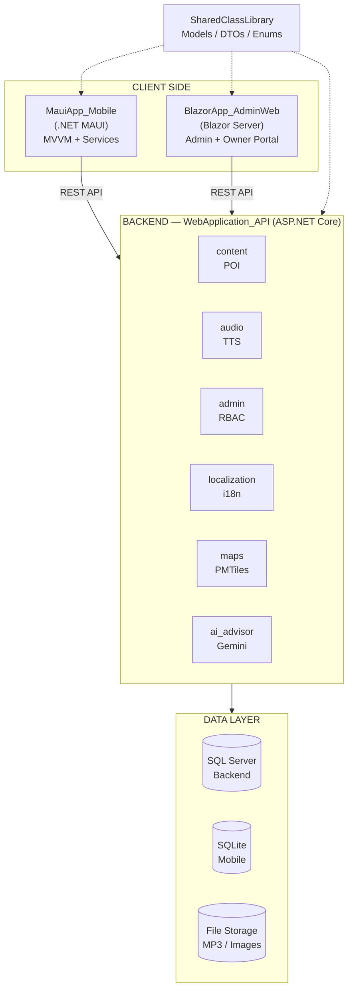
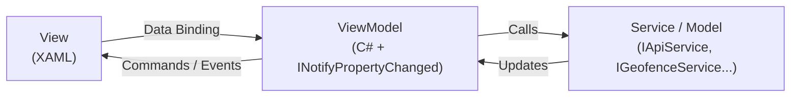
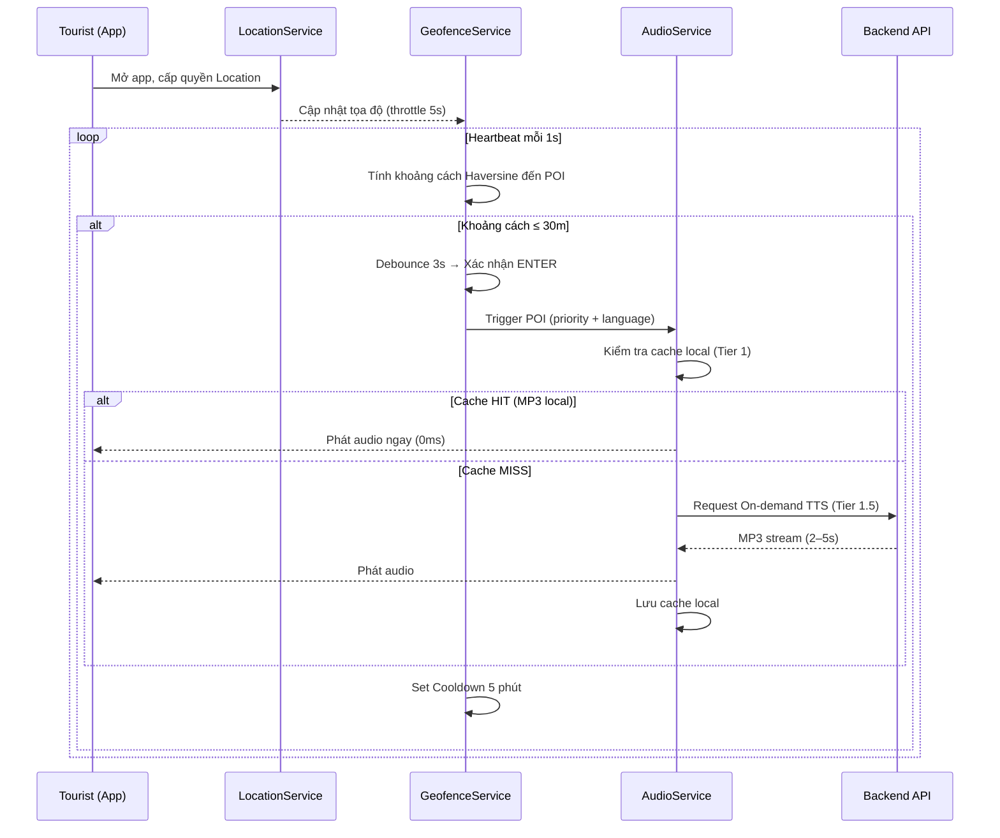
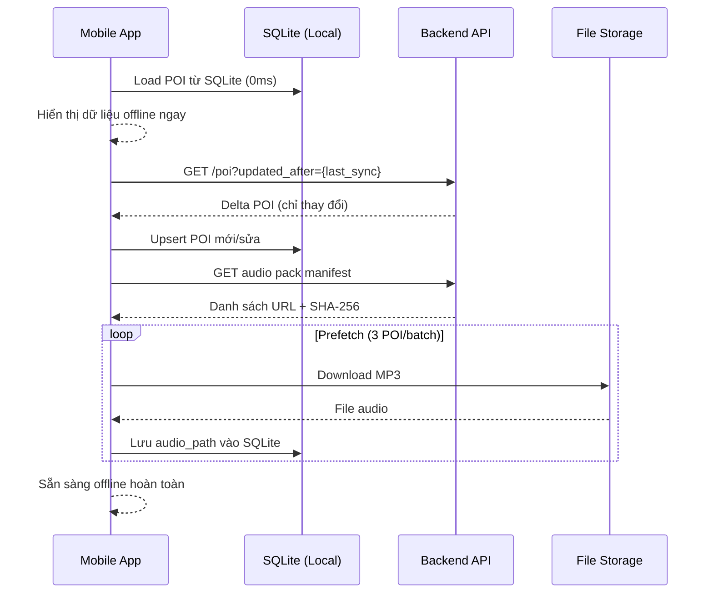
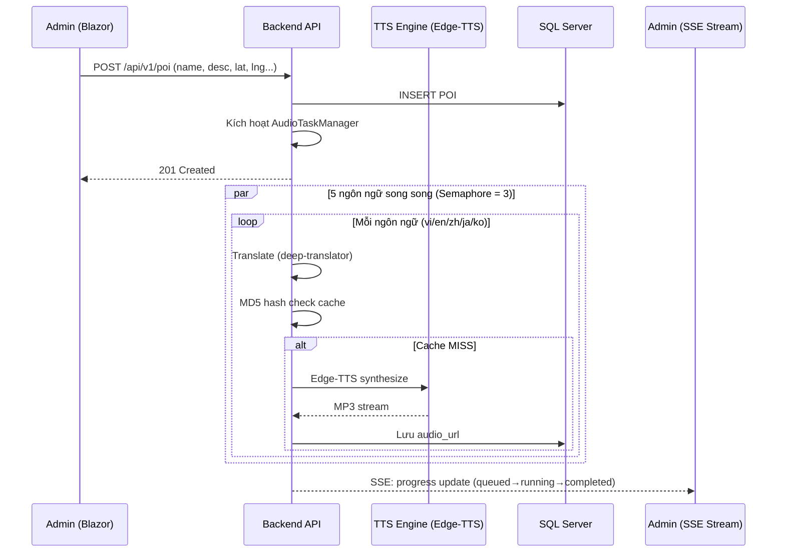
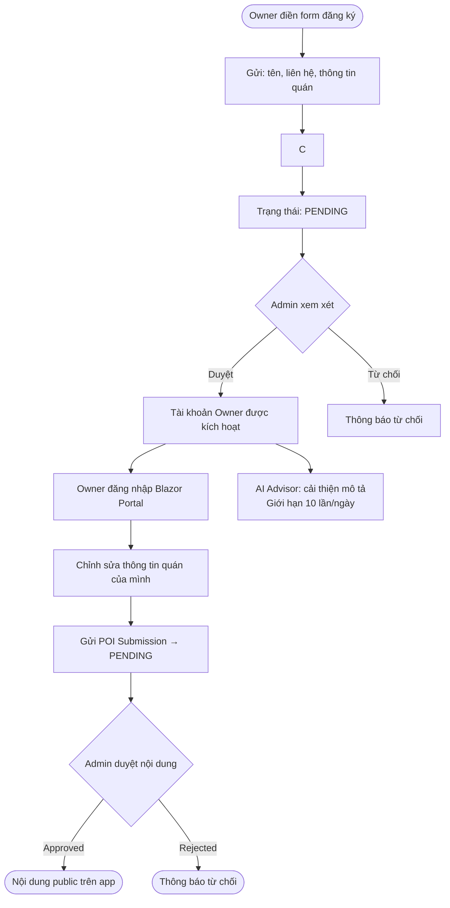
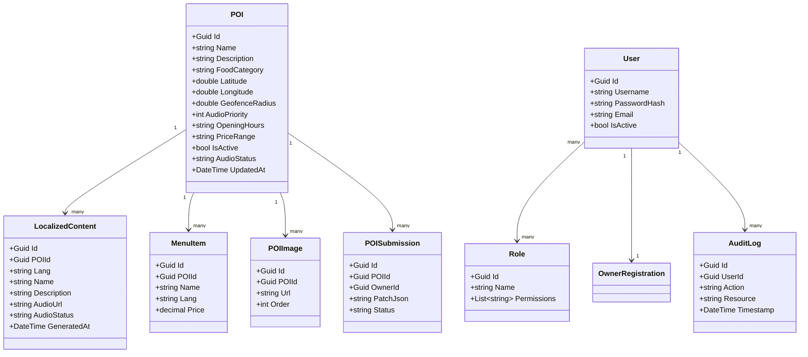
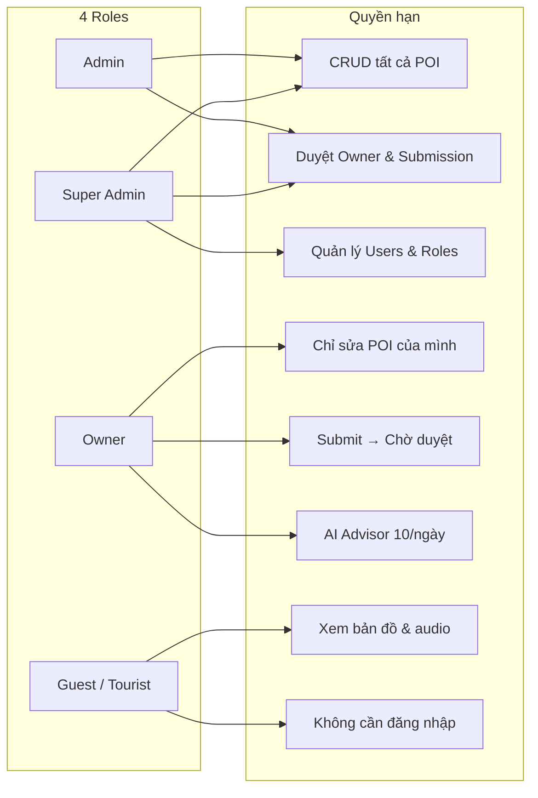
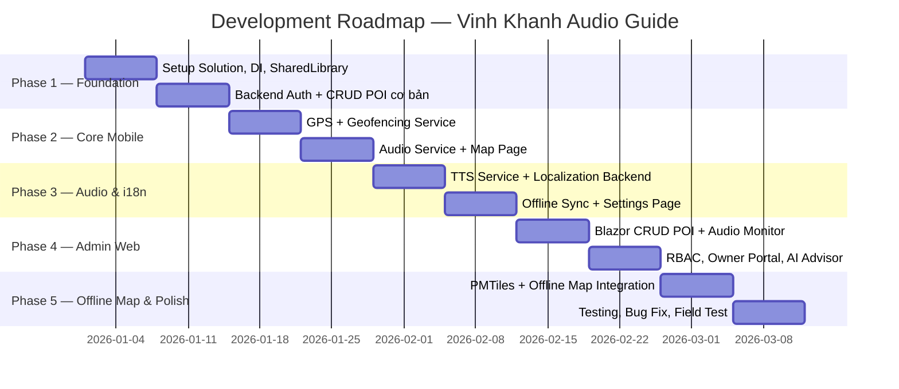

# App Thuyết Minh Phố Ẩm Thực Vĩnh Khánh
# Audio Guide App — Vinh Khanh Food Street

> **Type:** Product Requirements Document (PRD) ·

> **Version:** v0.1 ·

> **Year:** 2026 ·

> **Status:** In Development

---

## 1. Thành viên

| # | Họ và tên | MSSV |
|---|---|---|
| 1 | Nguyễn Sĩ Huy | 3123411122 |
| 2 | Nguyễn Văn Cường | 3123411045 |

---

## 2. Tổng Quan Dự Án

**Bối cảnh:** Phố Vĩnh Khánh (Quận 4, TP.HCM) là tuyến phố ẩm thực nổi tiếng, thu hút hàng nghìn du khách mỗi ngày. Du khách gặp khó khăn do rào cản ngôn ngữ và thiếu thông tin có cấu trúc.

**Giải pháp:** Hệ thống thuyết minh âm thanh đa ngôn ngữ gồm 3 thành phần:

| Thành phần | Công nghệ | Mô tả |
|---|---|---|
| **Mobile App** | .NET MAUI | Du khách nghe audio tự động qua GPS + Geofencing, bản đồ tương tác, offline-first |
| **Admin Web** | Blazor Server | Quản lý POI, audio, người dùng |
| **Backend API** | ASP.NET Core | REST API, TTS, RBAC, đồng bộ offline |

**Vấn đề & Giải pháp:**

| Vấn đề | Giải pháp |
|---|---|
| Không biết đặc trưng từng quán | POI có mô tả + ảnh + audio thuyết minh |
| Rào cản ngôn ngữ | Đa ngôn ngữ: vi, en, zh, ja, ko |
| Mạng không ổn định trong hẻm | Offline-first: SQLite + audio cache local |
| Không biết đứng gần quán nào | GPS + Geofencing tự động kích hoạt audio |
| Chủ quán khó cập nhật thông tin | Owner Portal trên web, duyệt bởi Admin |

---

## 3. Mục Tiêu & Chỉ Số Thành Công

**Mục tiêu chính:**
- Audio tự động, **không cần thao tác** khi du khách đi dạo.
- Hoạt động **100% offline** sau lần đồng bộ đầu tiên.
- Hỗ trợ **5 ngôn ngữ**: Việt, Anh, Trung, Nhật, Hàn.
- Chi phí vận hành **$0** (Edge-TTS + PMTiles).

| Chỉ số | Mục tiêu |
|---|---|
| Số POI có audio | ≥ 30 địa điểm |
| Thời gian phát audio sau trigger | ≤ 3 giây |
| Tỉ lệ thành công offline | 100% (sau sync) |
| Số ngôn ngữ | 5 |
| Thời gian load màn hình chính | ≤ 2 giây |

---

## 4. Đối Tượng Người Dùng

| Persona | Nhu cầu chính |
|---|---|
| 👤 Du khách nội địa | Xem bản đồ, nghe giới thiệu món ăn, biết giờ mở cửa |
| 🌏 Du khách quốc tế | Nghe audio bằng ngôn ngữ mẹ đẻ, xem ảnh, hiểu đặc trưng quán |
| 🏪 Chủ quán (Owner) | Cập nhật thông tin quán, menu, ảnh trên web admin |
| 🛡️ Quản trị viên (Admin) | CRUD POI, quản lý tài khoản, kiểm duyệt nội dung |

---

## 5. Phạm Vi Tính Năng (MVP)

| Tính năng | Platform |
|---|---|
| Bản đồ tương tác hiển thị POI | Mobile |
| GPS + Geofencing tự động kích hoạt audio | Mobile |
| Phát audio đa ngôn ngữ (5 tiếng) | Mobile |
| Tải dữ liệu offline (SQLite + audio cache) | Mobile |
| Màn hình chi tiết POI | Mobile |
| Đăng nhập Admin / Owner | Web |
| CRUD POI, Menu, Hình ảnh | Web |
| Quản lý tài khoản + phân quyền RBAC | Web |
| Sinh audio TTS tự động khi tạo POI | Backend |
| API RESTful + đồng bộ offline | Backend |
**Ngoài phạm vi:** Thanh toán, live chat, push notification, mạng xã hội.

Logic Tải Audio Theo Dung Lượng Thiết Bị
Khi người dùng chọn ngôn ngữ và tải gói offline, app kiểm tra dung lượng trống:

```
Tổng kích thước audio pack (ngôn ngữ đã chọn)
        ↓
┌───────────────────────────────────────┐
│  data size < free storage space?      │
└───────────────────────────────────────┘
        │ YES                    │ NO
        ▼                        ▼
  Tải toàn bộ audio        Stream từ server
  vào thiết bị             theo từng POI khi nghe
  → 100% offline           → Cần WiFi/4G
  → Không cần mạng nữa     → Cache dần sau khi nghe
```

Nguyên tắc:

Chỉ tải audio của ngôn ngữ đã chọn (vd: khách Nhật → chỉ tải ja, không tải vi/en/zh/ko).
Nếu đủ bộ nhớ: tải 1 lần lúc cài đặt, sau đó dùng offline hoàn toàn.
Nếu không đủ bộ nhớ: LRU cache — audio POI đã nghe được giữ lại, audio cũ ít dùng bị xóa.

| Trạng thái | Điều kiện | Hành vi |
|---|---|---|
| **Full offline** | `audio_pack_size ≤ free_space` | Tải hết, không cần mạng sau đó |
| **Streaming** | `audio_pack_size > free_space` | Stream + cache dần từng POI |
| **Hybrid** | Offline 80% + stream 20% | Audio gần (Hotset) tải trước, xa stream sau |

---

## 6. Kiến Trúc Hệ Thống

### 6.1 System Architecture Overview



### 6.2 MVVM Pattern (Mobile)



---

## 7. Luồng Nghiệp Vụ Chính

### 7.1 Geofencing → Audio Flow



### 7.2 Offline Sync Flow



### 7.3 Admin — Tạo POI & Sinh Audio



### 7.4 Owner Registration Flow



---

## 8. Mô Hình Dữ Liệu (UML Class Diagram)



---

## 9. Phân Quyền RBAC



---

## 10. Technology Stack

| Layer | Công nghệ | Lý do |
|---|---|---|
| Mobile | .NET MAUI (.NET 10) | Cross-platform Android/iOS/Windows |
| Mobile UI | XAML + MAUI Controls | Native UI, MVVM binding |
| Mobile Map | MapLibre + PMTiles | Offline + online map |
| Mobile DB | SQLite (sqlite-net-pcl) | Offline-first, nhẹ |
| Admin Web | Blazor Server (.NET 10) | C# fullstack, real-time SSE |
| Backend | ASP.NET Core Web API | REST, Middleware, CORS |
| ORM | Entity Framework Core 8 | Code-first, Migrations |
| Database | SQL Server (dev: SQLite) | Relational, RBAC, Audit Log |
| TTS | Edge-TTS (Microsoft) | Miễn phí, chất lượng cao |
| Translation | deep-translator (Google) | Miễn phí, đa ngôn ngữ |
| AI | Google Gemini 2.0 Flash | Cải thiện mô tả POI |
| Map Online | MapTiler API | Bản đồ toàn cầu |
| Map Offline | PMTiles | Single-file, offline binary |
| Auth | JWT (httpOnly Cookie + Bearer) | Bảo mật XSS/CSRF |

---

## 11. API Design (Tóm Tắt)

| Module | Endpoint | Method | Mô tả |
|---|---|---|---|
| **Content** | `/api/v1/poi` | GET/POST | Danh sách / Tạo POI |
| | `/api/v1/poi/{id}` | GET/PUT/DELETE | Chi tiết / Sửa / Xóa |
| | `/api/v1/poi/nearby` | GET | POI theo bán kính |
| **Audio** | `/api/v1/audio/tts` | POST | Sinh audio MP3 |
| | `/api/v1/audio/tasks/stream` | GET (SSE) | Real-time tiến trình |
| **Localization** | `/api/v1/localizations/prepare-hotset` | POST | Pre-dịch top POI gần nhất |
| | `/api/v1/localizations/on-demand` | POST | Dịch tức thì 1 POI |
| **Maps** | `/api/v1/maps/offline-manifest` | GET | Manifest PMTiles |
| | `/api/v1/maps/packs/{version}/{file}` | GET | Serve PMTiles |
| **Admin** | `/api/v1/admin/users` | GET/POST/PUT/DELETE | CRUD Users |
| | `/api/v1/admin/audit-logs` | GET | Xem Audit Log |
| **AI** | `/api/v1/ai/enhance-description` | POST | Cải thiện mô tả bằng Gemini |

---

## 12. Lộ Trình Phát Triển



---

## 13. Rủi Ro & Giảm Thiểu

| Rủi ro | Xác suất | Mức độ | Giảm thiểu |
|---|---|---|---|
| GPS không chính xác trong hẻm | Cao | Cao | Debounce 3s + geofence_radius 30m |
| Edge-TTS API bị giới hạn / down | Trung | Cao | MD5 cache; Device TTS fallback |
| Bộ nhớ thiết bị đầy | Trung | Trung | LRU audio cache eviction |
| MAUI cross-platform bug (iOS) | Cao | Trung | Focus Android trước (MVP) |
| Dữ liệu POI lỗi thời | Trung | Trung | Owner Portal tự cập nhật; Admin toggle |
| Thiếu kinh nghiệm MAUI | Trung | Cao | Android only; pair programming |

---

## Phụ Lục

### A. Hằng Số Hệ Thống

| Hằng số | Giá trị |
|---|---|
| GPS Throttle | 5 giây |
| Geofence Radius | 30m |
| Geofence Debounce | 3 giây |
| Geofence Cooldown | 5 phút |
| Max Concurrent TTS | 3 |
| AI Daily Limit (Owner) | 10 lần |
| Max POI Images | 8 ảnh / 5MB |
| PII Retention | 180 ngày |
| Access Token Expire | 30 phút |
| Refresh Token Expire | 7 ngày |

### B. Ngôn Ngữ & Giọng TTS

| Code | Ngôn ngữ | Giọng TTS |
|---|---|---|
| `vi` | Tiếng Việt | `vi-VN-HoaiMyNeural` |
| `en` | English | `en-US-JennyNeural` |
| `zh` | 中文 | `zh-CN-XiaoxiaoNeural` |
| `ja` | 日本語 | `ja-JP-NanamiNeural` |
| `ko` | 한국어 | `ko-KR-SunHiNeural` |

### C. Glossary

| Thuật ngữ | Định nghĩa |
|---|---|
| **POI** | Point of Interest — Điểm quan tâm (quán ăn) |
| **Geofence** | Vùng địa lý ảo, khi người dùng vào sẽ trigger sự kiện |
| **Haversine** | Công thức tính khoảng cách 2 tọa độ GPS |
| **PMTiles** | File bản đồ tile đơn, hỗ trợ offline |
| **TTS** | Text-to-Speech — Văn bản thành giọng nói |
| **RBAC** | Role-Based Access Control |
| **SSE** | Server-Sent Events — Push real-time từ server |
| **Hotset** | Top POI gần nhất được pre-dịch và pre-generate audio |
| **MVVM** | Model-View-ViewModel — Kiến trúc UI tách biệt logic |

---

*© 2026 — Nguyễn Sĩ Huy & Nguyễn Văn Cường — Dự Án Thuyết Minh Phố Ẩm Thực Vĩnh Khánh*
