# Sequence Diagrams From Code

Tài liệu này chỉ chứa các sequence rút ra từ code thật của đồ án. Không dùng luồng suy diễn hay ví dụ ngoài.

Nguồn chính đã đọc:
- `WebApplication_API/Controller/*.cs`
- `BlazorApp_AdminWeb/Components/Pages/*.razor`
- `BlazorApp_AdminWeb/Services/AdminApiClient.cs`
- `BlazorApp_AdminWeb/Services/AdminAuthService.cs`

## 1. Đăng nhập (Web Admin)

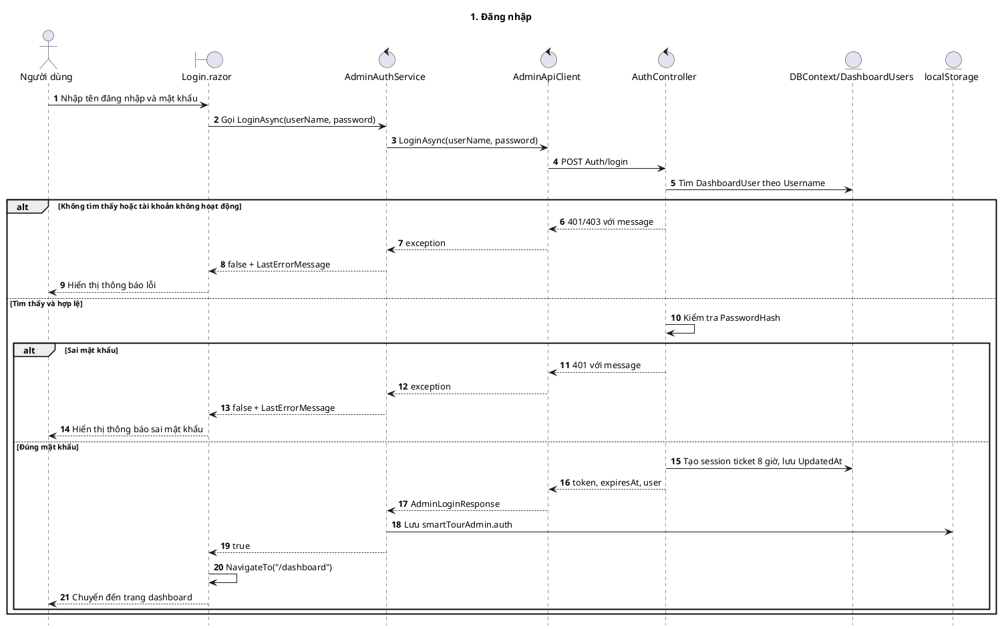

## 2. Dashboard (Web Admin)

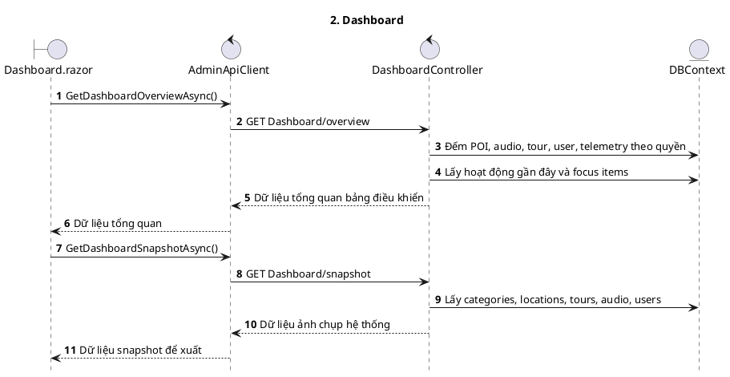

## 3. Danh mục (Web Admin)

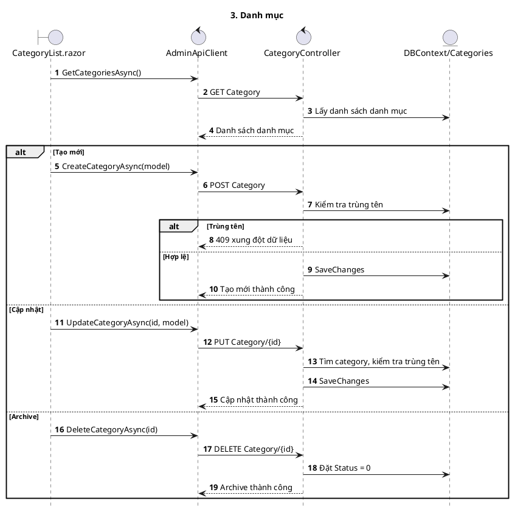

## 4. Ngôn ngữ (Web Admin)

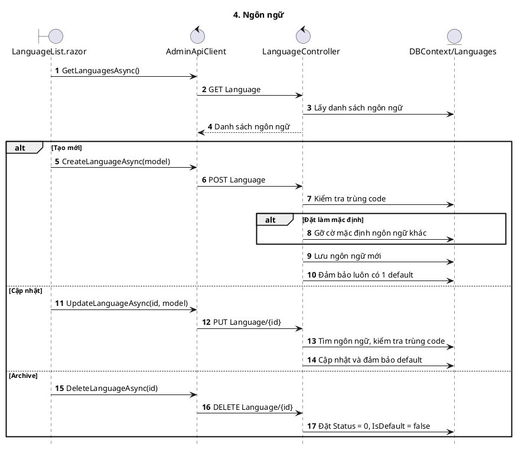

## 5. Địa điểm / POI (Web Admin)

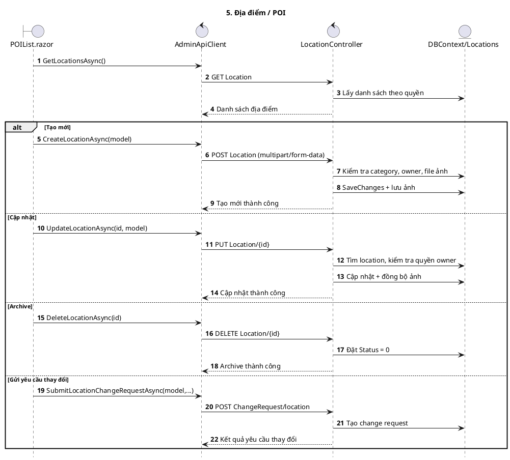

## 6. Audio (Web Admin)

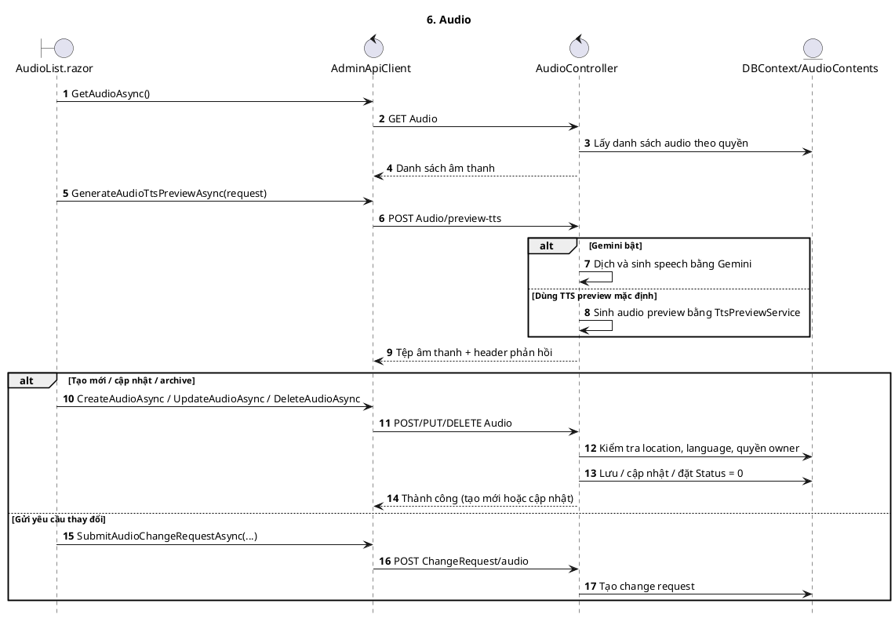

## 7. Tour (Web Admin)

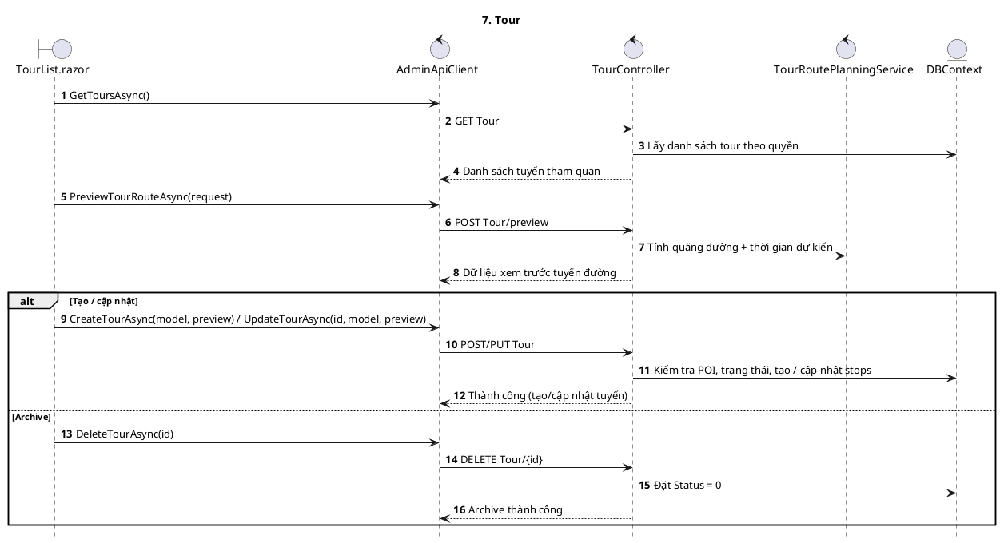

## 8. Người dùng dashboard (Web Admin)

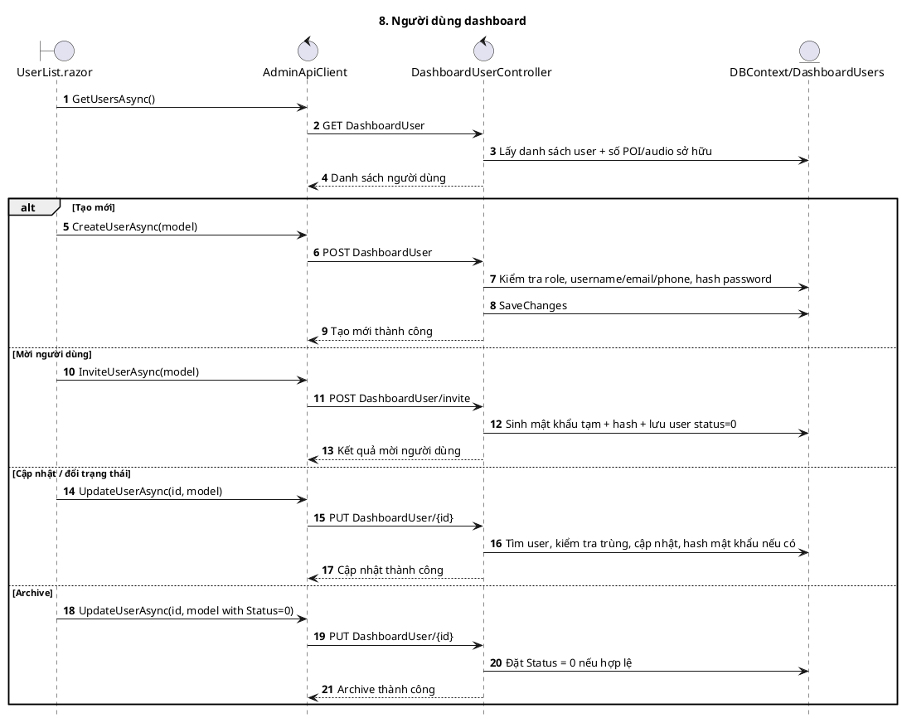

## 9. Hộp thư (Web Admin)

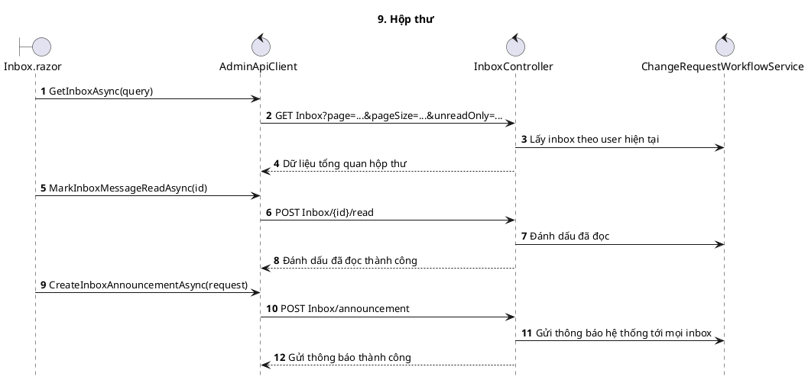

## 10. Moderation / Change request (Web Admin)

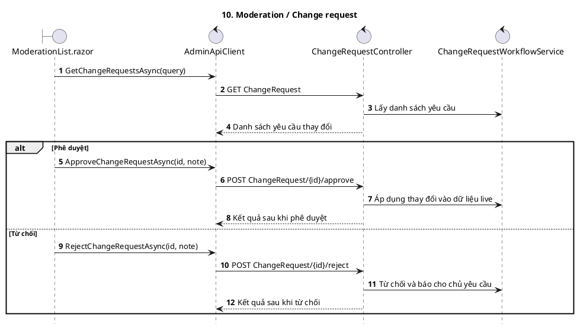

## 11. Usage history (Web Admin)

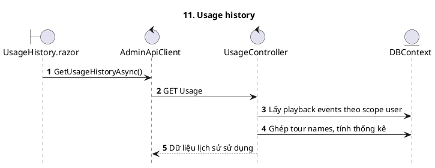

## 12. Statistics (Web Admin)

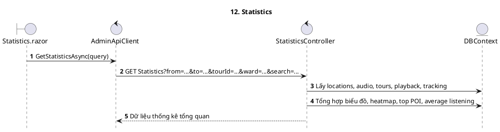

## Ghi chú

- Các sequence trên đều phản ánh hành vi đang có trong code.
- Nếu muốn vẽ tiếp màn hình phụ như `ActivityHistory.razor` hoặc các luồng JS preview ảnh/map, nên vẽ riêng vì đó là nhánh UI chứ không phải CRUD chính.
- Với Draw.io hiện tại, hãy dùng `Arrange -> Insert -> Advanced -> PlantUML`, rồi paste từng block `@startuml ... @enduml`.
